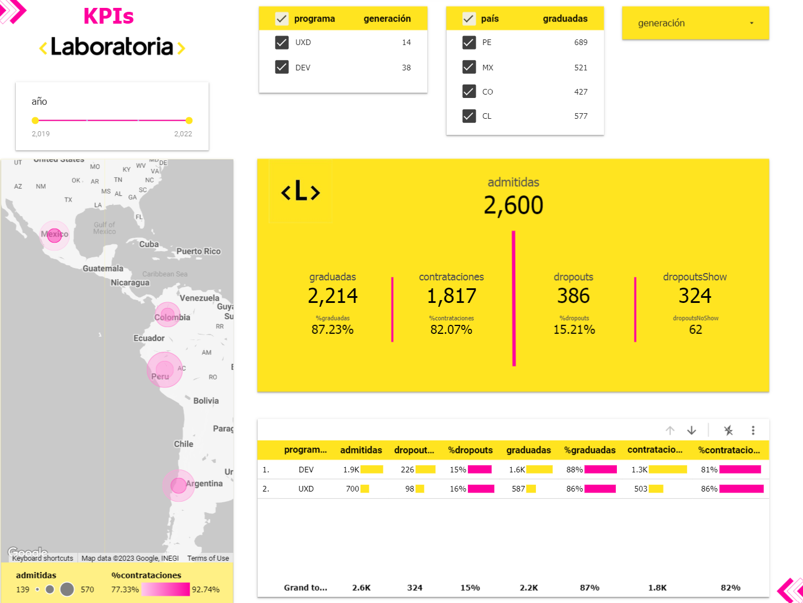
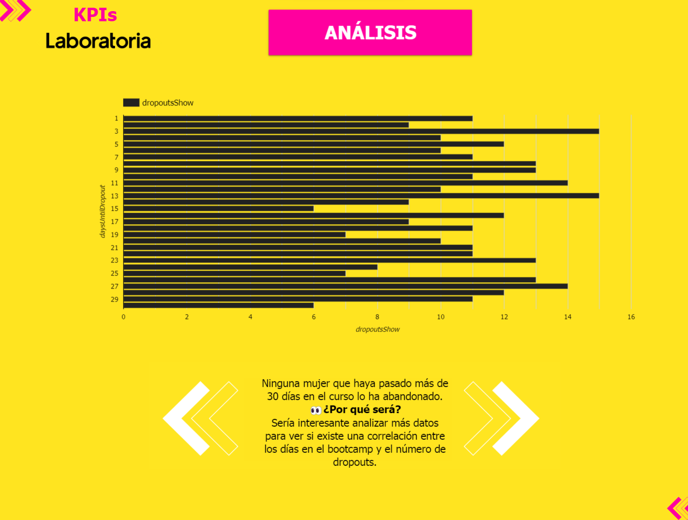

# Reto Técnico: Análisis Descriptivo de Datos

El reto técnico es una etapa requerida para el proceso de selección de Analista de Datos en Laboratoria.

## La entrega:
1. Un reporte en Looker Studio/Data Studio con las visualizaciones y el resumen de tu análisis. Recuerda dejar el dashboard en modo “Público”.
2. Un video, en castellano, en la plataforma de tu preferencia (recomendamos hacerlo en Loom) explicando la lógica por detrás del dashboard: queries, conexiones, actualización, etc (2-3 minutos) además de cuáles son las conclusiones y recomendaciones que darías desde el análisis descriptivo que hiciste (2-3 minutos).

## La data
La data está disponible en BigQuery y cuenta con 4 datasets (admission, bootcamp, core y placement). Cada dataset puede tener una o más tablas y la estructura sigue la descripción a continuación:

**Dataset “admission”**: Tablas que hacen referencia al proceso de admisión.
- Tabla “admitted”: Tabla con información de todas las admitidas al bootcamp de Laboratoria.
  - uid (key): llave (única) de cada estudiante.
  - bootcampCohortId (key): llave (única) de cada cohort.
  - admissionDate: fecha de la admisión.
  - country: código del país de residencia de la estudiante.

**Dataset “bootcamp”**: Tablas que hacen referencia al proceso de bootcamp.
- Tabla “dropouts”: Tabla con información de todas las ocurrencias de dropouts en el
bootcamp.
  - uid (key): llave (única) de cada estudiante.
  - bootcampCohortId (key): llave (única) de cada cohort.
  - dropoutDate: fecha del dropout.
  - reason: describe la “razón” del dropout. La columna tiene solamente 2 opciones:
    - “noShow”: no asistió el primer día del bootcamp.
    - “dropout”: asistió el primer día del bootcamp pero no volvió a asistir.
  - reasonDetail: detalles sobre el motivo del dropout.
  - notes: notas del equipo sobre el dropout.
  - completedProjects: número de proyectos completados en el bootcamp hasta el dropout.

- Tabla “graduates”: Tabla con información de todas las graduadas en el bootcamp.
  - uid (key): llave (única) de cada estudiante.
  - bootcampCohortId (key): llave (única) de cada cohort.
  - graduationDate: fecha de la graduación.

**Dataset “core”**: Tablas que hacen referencia al proceso administrativo interno.
- Tabla “cohorts”: Tabla con información sobre las cohortes (generaciones).
  - id (key): llave (única) de cada cohort de bootcamp (hace conexión con las columnas bootcampCohortId de las otras tablas).
  - generationName: nombre simbólico de la generación.
  - program: describe el programa a que se refiere el cohort. La columna tiene solamente 2 opciones:
    - DEV: si el cohort/generación es direccionado al desarrollo web.
    - UXD: si el cohort/generación es direccionado al diseño de experiencia de usuario.
  - vacancies: número de vacantes máximo de cada cohort.
  - startDate: fecha de inicio del bootcamp.
  - endDate: fecha de cierre del bootcamp.
  
  
**Dataset “placement”**: Tablas que hacen referencia al proceso de colocación laboral.
- Tabla “hires”: Tabla con información de todas las contrataciones.
  - uid (key): llave (única) de cada estudiante.
  - bootcampCohortId (key): llave (única) de cada cohort.
  - hireDate: fecha de la contratación.
  - jobStartDate: fecha de inicio del trabajo.
  - jobCurrency: moneda en la que reciben su salario.
  - grossSalaryLocal: salario/sueldo bruto en moneda local.
  - netSalaryLocal: salario/sueldo neto en moneda local.
  
## Propósito del análisis
El principal propósito del análisis es presentar los indicadores fundamentales de Laboratoria y su evolución a lo largo de los años en un dashboard en Looker Studio/Data Studio. Puedes agregar cualquier otro análisis que consideres interesante, además de filtros que ayuden la comprensión de los indicadores en casos específicos (por programa, país, nombre de la generación, etc).

# La resolución
## Google Big Query
```sql
WITH
  hire AS (
  SELECT
    *,
    ROW_NUMBER() OVER(PARTITION BY uid, bootcampCohortId ORDER BY hiredate DESC) AS row_num
  FROM
    laboratoria-simulator.placement.hires)

SELECT
  admitted.uid AS admittedID,
  dropout.uid AS dropoutTotalID,
  CASE
    WHEN dropout.reason = 'noShow' THEN dropout.uid
  ELSE
  NULL
END
  AS dropoutNoShowID,
  CASE
    WHEN dropout.reason = 'dropout' THEN dropout.uid
  ELSE
  NULL
END
  AS dropouID,
  graduate.uid AS graduateID,
  cohort.id AS cohortID,
  hire.uid AS hireID,
  admitted.bootcampCohortId AS admittedIDCohort,
  dropout.bootcampCohortId AS dropoutIDCohort,
  graduate.bootcampCohortId AS graduateIDCohort,
  hire.bootcampCohortId AS hireIDCohort,
  country,
  admissionDate,
  dropoutDate,
  reason,
  completedProjects,
  graduationDate,
  generationName,
  program,
  vacancies,
  startDate AS startDateProgram,
  endDate AS endDateProgram,
  DATE_DIFF(dropoutDate,admissionDate,day) AS daysUntilDropout,
  hiredate,
  jobStartDate,
  jobCurrency,
  grossSalaryLocal,
  netSalaryLocal

FROM
  laboratoria-simulator.admission.admitted AS admitted
LEFT JOIN
  laboratoria-simulator.bootcamp.dropouts AS dropout
ON
  admitted.uid = dropout.uid
  AND admitted.bootcampCohortId = dropout.bootcampCohortId

LEFT JOIN
  laboratoria-simulator.bootcamp.graduates AS graduate
ON
  admitted.uid = graduate.uid
  AND admitted.bootcampCohortId = graduate.bootcampCohortId

LEFT JOIN
  laboratoria-simulator.core.cohorts AS cohort
ON
  admitted.bootcampCohortId = cohort.ID
  
LEFT JOIN
  hire
ON
  admitted.uid = hire.uid
  AND admitted.bootcampCohortId = hire.bootcampCohortId
  AND hire.row_num = 1
```
## Dashboard KPIs de Laboratoria
- [Dashboard Google Looker](https://lookerstudio.google.com/reporting/a70861e1-a034-4cf7-81eb-24cb638762ee)




