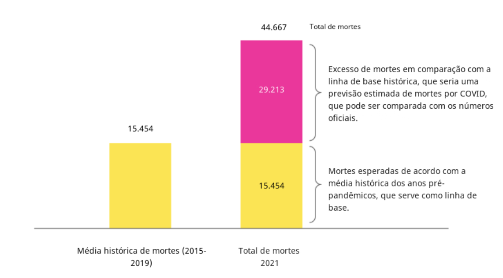
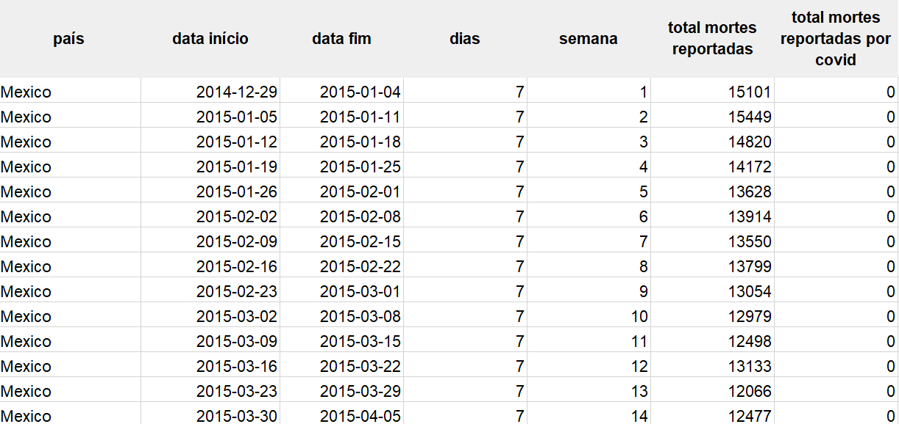
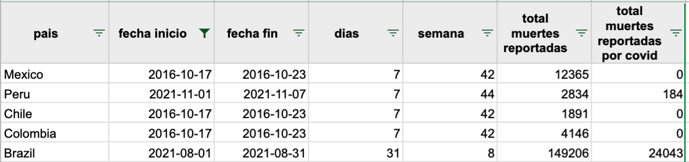
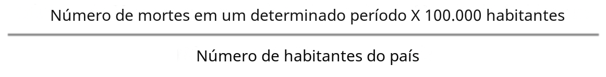
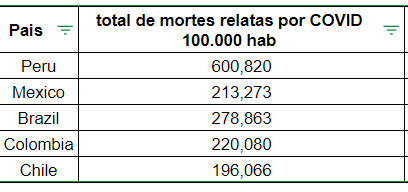
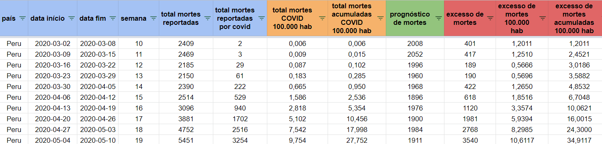
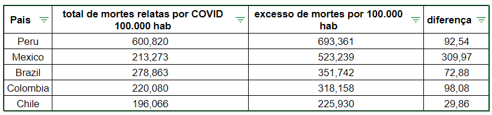
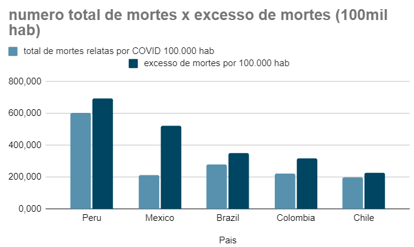
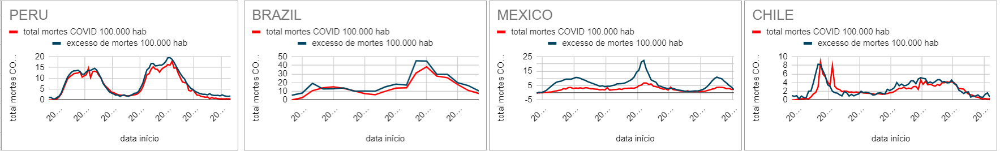

# Análise de excesso de mortes por COVID-19
# Introdução
Esse primeiro projeto foi o pré-requisito para a participação da Certificação de Análise de Dados. 

## Briefing
>Neste projeto, você fará uma análise, usando planilhas, de um conjunto de dados sobre óbitos por COVID-19 em 5 países da América Latina. Para realizar essa análise, você deve entender os dados, pensar criticamente para determinar os indicadores relevantes e construir visualizações que permitam comunicar suas descobertas.
Para conclusão do projeto, as seguintes perguntas devem ser respondidas:  
- Considerando os valores por 100.000 habitantes, em que país há a maior diferença entre os óbitos oficiais de COVID notificados e os excedentes estimados de óbitos? 
- Considerando os valores por 100.000 habitantes, em que país existe a menor diferença entre os óbitos oficiais por COVID notificados e os excedentes estimados de óbitos?
- Considerando os valores por 100.000 habitantes, qual é o país com o maior número de óbitos excedentes?  
Além disso, também deve conter:
- Tabela comparativa com o total de óbitos reportados pela COVID-19 por 100.000 habitantes, o total de "óbitos excedentes" por 100.000 habitantes e a diferença entre os dois valores, por país.
- Um gráfico que exibe os dados da tabela acima em forma de gráfico de barras. 
- Um gráfico para cada país que mostra a comparação da evolução ao longo do tempo das mortes relatadas de COVID-19 x o cálculo dos “excessos de óbitos” semana a semana, ambos dados por 100.000 habitantes.
- Um gráfico para cada país que mostra as mesmas variáveis do ponto anterior, mas acumuladas ao longo do tempo. 

## A situação
No último fim de semana, você estava com um grupo de amigos refletindo sobre o impacto da pandemia em nossas vidas. No meio da conversa, alguém perguntou qual país da América Latina seria o mais afetado pela pandemia. A mídia tem mencionado o Peru como um dos países mais afetados do mundo, mas em seu grupo de amigos há pessoas de vários países da região e cada um considera que a situação em seu país tem sido extremamente grave, e por isso não conseguem chegar a um acordo. Após uma breve discussão, vocês decidem que a melhor maneira de responder à pergunta é ir aos dados e formar um julgamento com base não em casos e experiências pessoais, mas em dados. 
A conversa então se voltou para determinar exatamente quais dados usar para análise. A COVID-19 causou surtos, hospitalizações, mortes, perdas econômicas e de empregos, danos psicológicos e uma série de outros efeitos. Seu grupo concorda que tentar cobrir todos os impactos possíveis seria excessivo e vocês determinam que o mais lógico para uma análise inicial é focar na análise dos dados de mortes devido à pandemia.  
Para isso, alguém sugere simplesmente calcular o total acumulado de mortes por COVID-19 relatadas e classificar os países, mas rapidamente percebem que isso naturalmente colocaria Brasil e México nas primeiras posições, já que possuem o maior número de habitantes e, portanto, o maior número de mortes. Para não comparar “maçãs com laranjas”, alguém sugeriu usar o indicador: **mortes por COVID-19 por 100.000 habitantes**, e o grupo concordou.  
Você decide assumir a tarefa de realizar esses cálculos e retornar ao grupo com algumas conclusões. No entanto, quando você estava prestes a começar a procurar dados oficiais de mortes por COVID-19 dos governos, uma colega mencionou que em um tópico do Twitter ela havia lido que os números oficiais de mortes por COVID-19 podem estar subestimando significativamente o número real de mortes. O tópico fez referência a um artigo em um meio internacional reconhecido que mencionou vários motivos pelos quais essa subestimação poderia acontecer:  
>_“Em primeiro lugar, as estatísticas oficiais [de mortes por COVID-19] em muitos países excluem as vítimas que não tiveram teste positivo para coronavírus antes de morrer, o que pode ser uma maioria substancial em locais com pouca capacidade de teste. Em segundo lugar, hospitais e registros civis podem não processar atestados de óbito por vários dias, ou mesmo semanas, causando atrasos nos dados. E terceiro, a pandemia dificultou o tratamento de outras doenças pelos médicos e desencorajou as pessoas a irem ao hospital, o que pode ter indiretamente levado a um aumento nas mortes por doenças diferentes da Covid-19.” 
>The Economist - “As verdadeiras mortes da pandemia_” 
Sua amiga propõe então que um indicador melhor para analisar o impacto da COVID-19 na mortalidade nos países é **calcular o “excesso de mortes”**. Ela explica que isso **é calculado tomando o número de pessoas que morreram por qualquer causa (não apenas COVID-19) em um determinado período de tempo e em um determinado lugar, e comparando-o com as mortes que teriam ocorrido se a COVID-19 não tivesse ocorrido** - o que pode ser estimado com uma linha de base histórica de mortes que ocorreram durante os últimos anos pré-pandêmicos. Por exemplo, se no México (num determinado local), durante a terceira semana de janeiro de 2021 (num determinado período de tempo), foram notificados 44.667 óbitos totais (por todas as causas, não apenas COVID-19), e sabemos que em nos 5 anos anteriores à pandemia, naquela mesma semana, no México, em média, morreram 15.454 pessoas (linha de base histórica), poderíamos dizer que a diferença de 29.213 mortes (44.667 menos 15.454) pode ser atribuída à pandemia. Em outras palavras, o “excesso de mortes” (em comparação com uma estimativa dos 5 anos anteriores) é o que é atribuído à pandemia. 
  
**Assim, o desafio que você assumiu é calcular as estimativas do excesso de mortes da Covid-19 por 100.000 habitantes e comparar os números entre os países da região.** 

# Resolução
## 1. Revisão do dataset e estrutura dos dados
Os dados que você usará contêm informações sobre o total de mortes e sobre as mortes relatadas por COVID-19 nos países do México, Peru, Chile, Colômbia e Brasil. Esse conjunto de dados foi processado e armazenado nesta planilha do Google:  
  
O dataset tem:
- 1.332 linhas, cada linha representa o acumulado por semana ou mês do total de mortes e das mortes causadas por COVID-19.
As colunas são:
   - **país**: nome do país (podem ser: México, Peru, Chile, Brasil e Colômbia).
   - **data de início**: data de início do intervalo de contagem de mortes.
   - **data de término**: data de término do intervalo de contagem de mortes.
   - **dias**: número de dias da contagem de óbitos. No caso do Chile, Peru, Colômbia e México é uma semana (7 dias). Para o Brasil, os dados são acumulados mensalmente (28, 30 e 31 dias).
   - **semana**: número da semana ou mês do ano.
   - **total de mortes relatadas**: é o total de óbitos notificados por qualquer causa (não apenas COVID-19) no intervalo de datas estabelecido (óbitos em uma semana ou mês).
   - **total de mortes relatadas por COVID-19**: é o total de óbitos notificados causados por COVID-19 no intervalo de datas estabelecido (óbitos em uma semana ou mês).
  
## 2. Compreensão do dataset
    
A imagem acima mostra 5 linhas do dataset, cujo conteúdo está explicado a seguir: 
- A primeira linha mostra o número de mortes no México de 2016-10-17 a 2016-10-23 (7 dias no total). Esse intervalo de datas representa a semana 42 de 2016 (lembre-se de que um ano tem 52 ou 53 semanas no total), e nessas datas foram relatadas 12.365 mortes no total e zero mortes causadas por COVID-19. Isso faz sentido, já que a COVID-19 só apareceu em 2020 e essa linha contém dados de 2016.
- A segunda linha mostra o número de mortes no Peru no intervalo de 2021-11-01 a 2021-11-07 (7 dias, semana 44 do ano) com um total de 2.834 mortes totais e 184 mortes causadas por COVID-19.
- A última linha mostra o número de mortes no Brasil no intervalo de 2021-08-01 a 2021-08-31 (31 dias, 8º mês do ano) com um total de 149.206 mortes e 24.043 mortes causadas por COVID.
Cada linha contém o acumulado por semana ou mês do número total de mortes e o número de mortes causadas por COVID-19 nos 5 países.

## 3. Criação de uma cópia do banco de dados
Para iniciar o projeto, crie uma nova planilha com sua conta do Google e importe o banco de dados usando a função IMPORTRANGE.  
`IMPORTRANGE(url_da_planilha; string_do_intervalo)`

## 4. Resolução
### 4.1 Cálculo do número total de mortes por COVID por 100.000 habitantes
O número de mortes é normalmente expresso como "o número de mortes por 1.000, 10.000, 100.000 ou um milhão de habitantes", com o propósito de fazer comparações objetivas com cidades ou países que têm diferentes números de habitantes. Em nosso caso, multiplicaremos as mortes por 100.000 e dividiremos o resultado pela população total.  
  

Antes de realizar o cálculo de cada país, é necessário filtrar o dataset pela função `QUERY`.  
`QUERY(dados; consulta; [cabecalhos])`  
Exemplo aplicado no Peru:  
`=QUERY(DADOS!A:G; "SELECT A, B, C, E, F, G WHERE A='Peru' AND B>= date '2020-03-02'")`

Depois de carregar os dados de cada país, crie uma nova coluna para o cálculo das mortes por COVID por 100.000 habitantes e aplique a fórmula explicada acima. Para identificar o valor de habitantes do país, utilize a função `PROCV / VLOOKUP` do Planilhas Google para a tabela no dataset ("Poblacion").
Os resultados dos cálculos são:  
  

### 4.2 Cálculo do total acumulado de mortes por COVID por 100.000 habitantes
O próximo passo é saber o número acumulado de óbitos por data, muito semelhante aos resultados anteriores, com a diferença de que adicionaremos o número de óbitos acumulados do dia anterior com o dia atual. 

### 4.3 Cálculo do prognóstico de mortes usando médias simples 
Como comentado no início do projeto, o objetivo é fazer uma comparação das mortes notificadas por COVID-19 (cálculos já realizados acima) versus o excesso de mortes. Este último termo é o que explicaremos a seguir:
>O excesso de mortes será calculado como a diferença entre e total de mortes notificadas menos o prognóstico de mortes.

**Prognóstico de mortes**: para calcular a previsão para um determinado período de tempo, utilizaremos o cálculo de médias simples.

Use a função `MÉDIA.SE.S./AVERAGEIFS` para calcular a previsão de mortes nas Planilhas do Google.
Exemplo aplicado:
`=IFERROR(AVERAGEIFS(DADOS!F:F;DADOS!A:A;"=Peru";DADOS!G:G;"=0";DADOS!E:E;D2);I1)`

### 4.4 Cálculo do excesso de mortes por COVID
A próxima etapa é calcular o excesso de mortes. Basta subtrairmos o número total de mortes notificadas menos o prognóstico de mortes.

### 4.5 Cálculo do excesso de mortes por COVID por 100.000 habitantes
Para fazer comparações, vamos converter os números de mortes para valores por 100.000 habitantes, muito semelhante ao que desenvolvemos na Etapa 4.1. Crie uma coluna "Excesso de mortes por COVID por 100.000 habitantes" e aplique a fórmula aprendida nas etapas anteriores.

### 4.6 Cálculo do excesso de mortes por COVID por 100.000 habitantes acumuladas
Muito semelhante ao que desenvolvemos na Etapa 4.2, vamos calcular o excesso de mortes acumuladas por 100.000 habitantes para fazer uma comparação com os números oficiais de mortes acumuladas. Crie uma coluna "Excesso de mortes acumuladas por COVID por 100.000 habitantes" e aplique a fórmula aprendida nas etapas anteriores. 
A imagem a seguir mostra os resultados da nova coluna.  

## 5. Entrega final
- Uma tabela comparativa com o total de mortes por COVID-19 notificadas por 100 mil habitantes, o total de “mortes em excesso” por 100 mil habitantes e a diferença entre os dois valores, por país:

- Um gráfico mostrando os dados da tabela acima como um gráfico de barras: 

- Um gráfico para cada país que mostra a comparação da evolução ao longo do tempo das mortes notificados por COVID-19 versus o cálculo do "excesso de mortes" semana a semana, ambos dados por 100 mil habitantes:

- Um gráfico para cada país que mostra as mesmas variáveis do ponto anterior, mas acumuladas ao longo do tempo:

- Considerando os valores por 100.000 habitantes, em que país há a maior diferença entre os óbitos oficiais de COVID notificados e os excedentes estimados de óbitos? México. 
- Considerando os valores por 100.000 habitantes, em que país existe a menor diferença entre os óbitos oficiais por COVID notificados e os excedentes estimados de óbitos? Chile.
- Considerando os valores por 100.000 habitantes, qual é o país com o maior número de óbitos excedentes? Perú.

# Objetivos de Aprendizado
- Usar gráficos básicos para resumir as informações.
- Estratégias para aprender e desenvolver habilidades de forma independente.
- A classificar dados e extrair informações usando planilhas.

