# Segmentação de clientes no E-commerce
# Introdução
Esse foi o terceiro projeto da Certificação de Análise de Dados da IBM/Laboratoria.
- Google Sheets, cohort, análise de churn, análise RFM, Google Looker.
- Cursos importantes para conclusão do projeto: [Google Data Studio: o Curso Completo](https://ude.my/UC-5a183d3a-901e-475f-bb91-cbe058caf782) e [Estatística para Ciência de Dados e Machine Learning](https://www.udemy.com/course/estatistica-para-ciencia-de-dados-machine-learning/)

## Briefing
Neste projeto, você realizará uma análise descritiva que mostrará à CEO de uma empresa de varejo o quão bem ou mal as vendas estão indo na empresa, medirá o engajamento do cliente com base em uma análise de coorte e realizará uma segmentação de clientes aplicando a metodologia RFM, para que o negócio possa focar seus esforços e adotar estratégias diferenciadas para cada segmento. Além disso, você aprenderá a importância da limpeza e do tratamento dos dados antes de realizar qualquer análise.

**Entregável**:
- Fonte de dados pré-processada (dados limpos)
- Um guia de relatório com gráficos das principais métricas de negócios
- Uma guia com uma análise por coorte geral e também para clientes do Reino Unido e clientes fora do Reino Unido
- Uma segmentação usando a metodologia RFM
- Todos os dados, tabelas e visualizações adicionais que contribuem para sua análise

# A situação
Você é Analista de Dados de uma consultoria de transformação digital que busca "apoiar nossos clientes na melhoria de seus negócios por meio de dados", como pode ser visto em seu site. O serviço mais contratado da empresa é o Business Intelligence, que busca integrar, visualizar e analisar grandes volumes de dados históricos para apoiar a tomada de decisões estratégicas.

Seu chefe a convida para uma reunião com um novo cliente: UK Merch. Trata-se de uma empresa jovem, com apenas 10 meses, que se dedica à venda de vestuário no atacado, ou seja, vende em quantidades relativamente grandes (geralmente 20 peças ou mais) e oferece um preço mais competitivo que o varejo convencional. Seus clientes são empresas menores que abastecem seu estoque comprando da UK Merch.

Na reunião, você conhece Frederico, Gerente Administrativo e Financeiro da empresa, e Alessandra, a CEO. "Abrimos há cerca de um ano no Reino Unido", Frederico começa nos dizendo. "Depois de alguns meses, como vimos que as vendas estavam indo bem e que nossos preços eram competitivos, decidimos expandir nossa operação para outros países da Europa."

"Embora novos clientes tenham começado a chegar, não temos certeza se foi a decisão certa", acrescenta Alessandra. "Isso tornou nosso dia a dia mais complexo. Não temos certeza de onde vêm nossos melhores clientes, não temos sido muito rigorosos na coleta de dados e não sabemos como focar o trabalho de nossa equipe".

Ambos ficam calados e atentos enquanto seu chefe dispara perguntas para ter uma ideia da situação financeira do negócio.

"Quanto vocês vendem em média por mês? Quantas vendas vocês têm em cada mês? Qual é o mês em que vocês mais vendem? Quais são seus clientes mais importantes? Qual é o valor médio que seus clientes gastam? Qual porcentagem de seus clientes voltou a comprar? Como esta informação é desagregada de acordo com os países onde vocês vendem?"

Ao tomar nota dessas novas perguntas e termos, você vê que Frederico e Alessandra se entreolham confusos.

"Nós não sabemos como responder a nenhuma dessas perguntas", Alessandra responde, envergonhada.

"Se vocês não conhecem suas vendas, ou o perfil de seus clientes, ou quão leais eles são, como vocês concentram seus esforços de marketing? A quem seus esforços de publicidade são direcionados? Qual é sua estratégia de vendas?", segue seu chefe

"Nossa mensagem e estratégia é a mesma para todos os nossos clientes", responde a CEO, sabendo que não é a melhor resposta para essas perguntas.

"Há muito o que fazer", diz seu chefe olhando para você.

Saindo da reunião, você caminha com seu chefe pelo corredor enquanto ele lhe dá instruções: "Este é um tipo típico de cliente. Eles têm um bom modelo de negócios em mãos, mas não têm certeza se a estratégia que estão usando é a correta. Além disso, eles claramente não estão tomando decisões com base em dados. Alessandra, a CEO, compartilhou comigo um conjunto de dados das vendas do ano passado por fatura. Aparentemente, os dados não estão completos, mas é a única coisa que temos para trabalhar."

Você quase esbarra em um colega enquanto ainda está andando e fazendo anotações.

"A primeira coisa será revisar a qualidade dos dados. Eu sinto que eles não foram muito rigorosos na coleta de dados, então primeiro você deve verificar dados ausentes, dados duplicados sem correspondência (por exemplo, que a mesma nota foi registrada duas vezes) e valores que não fazem sentido, como números negativos nos preços ou quantidades dos itens".

Vocês chegam ao escritório. Ele se senta e continua: "Depois, teremos que ter uma ideia geral da saúde do negócio. Para isso, você deve construir um dashboard que mostre as principais métricas de negócios, como as que lhe pedi na reunião, mas também gostaria que você fizesse sua própria colheita. Investigue e adicione as métricas e gráficos que você julgar convenientes para resumir os dados".

"O que eu ainda não tenho muito claro é como medir a retenção de clientes…", ele pensa em voz alta enquanto toma um gole de café. A isso, você responde que aprendeu recentemente a fazer análise de coorte. Você já a aplicou para medir a retenção em uma startup SaaS mas alguns dias atrás você leu um artigo que explicava que você poderia fazer algo semelhante se tomasse a data da primeira compra de um cliente como a data de início da coorte. "Eu gosto da ideia! Podemos fazer essa análise separadamente para clientes do Reino Unido e estrangeiros para ver se sua expansão apressada fez sentido", conclui seu chefe.

“Acredito que a contribuição mais significativa que podemos dar a essa empresa nesta consultoria é ajudá-la a segmentar seus clientes para tomar decisões estratégicas entendendo o público-alvo. Você já ouviu falar sobre a lei de Pareto?“. Vendo seu rosto confuso, ele passa a explicar: “Pareto postula que 80% dos lucros vêm de 20% do esforço. Não é necessário fazer todos os esforços para que um negócio funcione bem, basta ser inteligente e focar seus recursos estrategicamente para obter ótimos resultados. No caso da UK Merch, suspeito que eles estejam gastando mal seus recursos. Eles poderiam focar sua comunicação com muito mais eficiência, focada num público limitado de bons clientes. Para isso preciso que você faça uma segmentação baseada em Recência, Frequência e Quantidade (RFM) e desta forma podemos recomendar estratégias específicas para a UK Merch para atender seus clientes.”

# Resolução
## 1. Importar, entender o conjunto de dados e limpar os dados
Importar o dataset no Google Sheets.

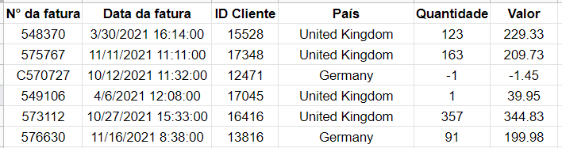

Ao importá-lo para o Planilhas Google e olhar a primeira linha, podemos interpretar esse registro da seguinte forma: o cliente 15528 do Reino Unido efetuou uma compra em 30 de março de 2021 às 16h14 no valor de 229,33 libras esterlinas, que inclui 123 produtos e gerou a fatura cujo número é 548370.

### 1.1 Detecção de nulos ou vazios
`CONTAR.VAZIO()` ou `=COUNTBLANK()`

Todos os dados vazios ou nulos foram deletados.

### 1.2 Detecção e remoção de dados duplicados
É importante entender quando um dado duplicado está incorreto. Em nosso caso, se encontrarmos mais de uma linha que tenha o mesmo valor ou a mesma quantidade, isso não seria um erro. Isso significaria apenas que em momentos diferentes, usuários diferentes compraram a mesma quantidade ou gastaram o mesmo valor. É muito comum que isso aconteça.

O que não deveria acontecer neste caso é termos a mesma fatura duas vezes. Como se supõe que cada fatura tenha um número único, então, se encontrarmos outra linha com o mesmo número de fatura, devemos apagar o que está duplicado.

Vamos remover dados duplicados, ou seja, as linhas que compartilham valores na coluna de número da fatura (Dados > Limpeza de dados > Remover cópias).

### 1.3 Detecção e eliminação de quantidades negativas
Os valores negativos não são necessariamente incorretos. As faturas que começam com a letra C correspondem a devoluções e, portanto, podemos assumir que a isso se devem os valores negativos (a venda é positiva, a devolução é negativa).
Como só queremos analisar as vendas do negócio (e não as devoluções), devemos remover esses valores do nosso conjunto de dados. 

## 2. Análise das métricas de vendas
### 2.1 Análise do número de faturas por país
Uma coisa interessante a analisar é o número de faturas emitidas para cada país e a porcentagem de faturas representada por cada país.

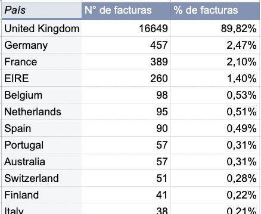

É evidente que os clientes do Reino Unido são os que mais compram no supermercado, visto que a empresa nasceu lá. Os próximos 5 países com maior quantidade de compras são Alemanha, França, Irlanda, Bélgica e Holanda.

### 2.2 Análise de valor total por país
Podemos fazer algo semelhante, mas agora levando em conta a variável valor. Aqui, podemos aproveitar para fazer uma análise um pouco mais aprofundada. Além do montante somado e da porcentagem que cada país representa do total, seria interessante saber o valor médio, o valor mínimo e o valor máximo em cada caso.

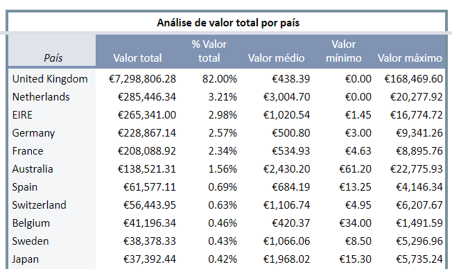

Nesta ocasião, pode-se constatar que o Reino Unido representa 82% do valor das vendas, porém teve quase 90% das transações. Isso significa que há países que, em média, gastam mais por transação no UK Merch. Isso pode ser validado na coluna "Valor médio" onde vemos que o Reino Unido tem uma das médias mais baixas por transação, enquanto Holanda e Austrália têm as médias mais altas.

### 2.3 Faturas geradas por mês
Para realizar a análise por mês, teremos que processar a coluna "Data da fatura". Essa coluna contém a data da fatura, mas com muitas informações que não precisamos (por exemplo, dia, hora e minutos). Para isso, temos que criar uma nova coluna "ANO - MÊS", onde gostaríamos de exibir a data no formato 2021-03 para cada linha.

Com essa nova coluna, podemos agora gerar uma tabela dinâmica que informe o número de faturas em cada mês, e depois fazer um gráfico desses valores:

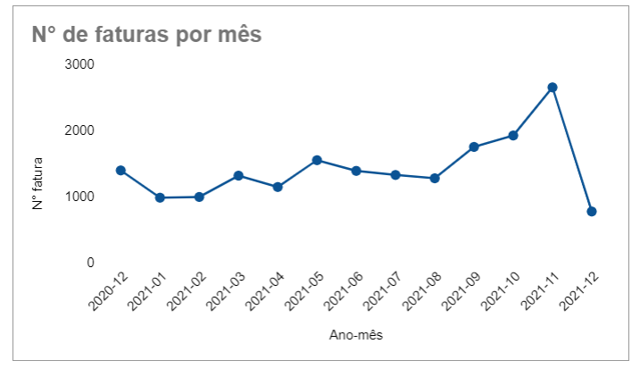

### 2.4 Número de faturas do Reino Unido versus estrangeiras por mês
Dado que o UK Merch abriu suas fronteiras para outros países, seria uma boa ideia relatar como estão essas vendas e poder mostrar se existe mercado. Então vamos segmentar nossos clientes em dois grupos: os que pertencem ao Reino Unido e os que não pertencem ao Reino Unido.

Para isso, criamos uma coluna "Pertence ao Reino Unido?" e usamos a fórmula:
`=SE(PAÍS="Reino Unido";"SIM";"NÃO")`

Com essa nova variável, podemos criar uma tabela dinâmica que conta o número de faturas para cada um dos casos na nova coluna "Pertence ao Reino Unido?". Com esta nova tabela dinâmica, podemos gerar uma série cronológica comparando os dois tipos de clientes:

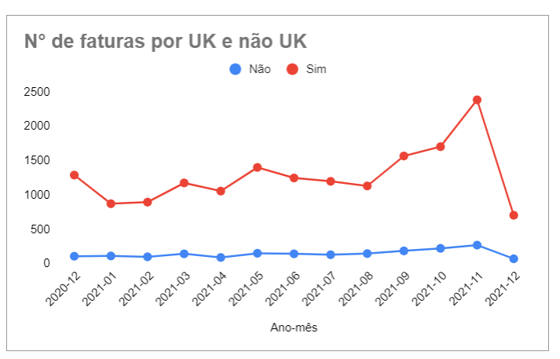

### 2.5 Número de novos clientes por mês
Já vimos que novembro foi um mês muito bom para a UK Merch. Foram geradas muito mais faturas. Esse aumento nas vendas pode ser devido a poucos clientes fazendo muitas compras, ou a um grande número de clientes que levaram a um aumento no volume de compras. Para resolver essa questão, uma boa ideia é fazer um gráfico do número de clientes únicos mês a mês e ver se o aumento das faturas está relacionado com o aumento de clientes únicos.

Mais uma vez, você pode fazer uma tabela dinâmica que use meses-anos como linhas e cujo valor calculado seja o número de clientes. Isso pode ser calculado usando a coluna ID Cliente e fazendo uma contagem única `COUNTUNIQUE` para que tome apenas valores exclusivos.
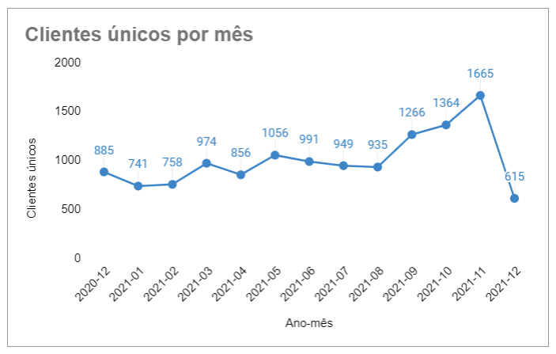

## 3. Análise de coorte
### 3.1 Replicar os dados em outra aba e criar a coluna coorte
Copiar os dados para outra aba através da função `QUERY`. 
Aos mesmos dados, adicionamos uma coluna extra que chamaremos de "Coorte". Aqui queremos armazenar o valor da data de entrada de cada cliente - essa data de entrada no coorte será sua primeira data de compra.
Para encontrar esse valor, utilizaremos a função PROCV no conjunto de dados original.

`=PROCV(IDCLIENTE;DATASET;COLUNA DE MÊS-ANO;0)`

Essa fórmula buscará a primeira ocorrência do ID do cliente no conjunto de dados e retornará a data associada. Antes de aplicar a fórmula, devemos classificar o conjunto de dados onde pesquisaremos de acordo com seu ANO-MÊS em ordem crescente, para ter certeza de que a data retornada pela fórmula é a primeira compra do cliente.

### 3.2 Criar tabela dinâmica
Vamos criar uma tabela dinâmica cujas linhas são a coorte, as colunas são as datas ano-mês e os valores são o número de clientes únicos que fizeram compras nesses meses.

### 3.3 Transformar tabela dinâmica em análise por mês
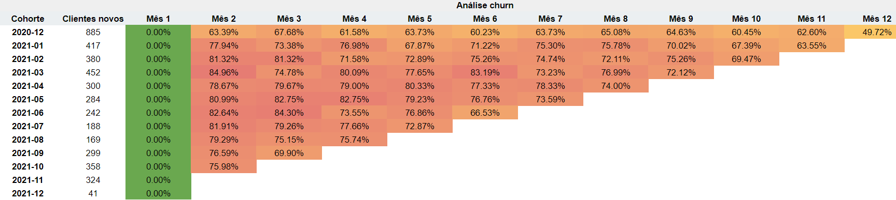

## 4. Segmentação de clientes
Essa metodologia permite classificar os clientes nas três variáveis mencionadas:

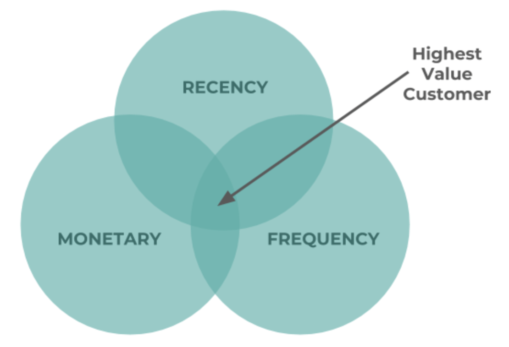

Uma vez calculadas as variáveis de Recência, Frequência e Valor Monetário para todos os clientes, as categorizamos conforme o quartil em que se encontra cada cliente para cada variável. 

>É importante notar que essa análise pode ser feita por quartis, assim como por quintis, terços, percentis ou qualquer divisão que a analista de dados prefira. Quanto mais divisões, mais fina é a análise.

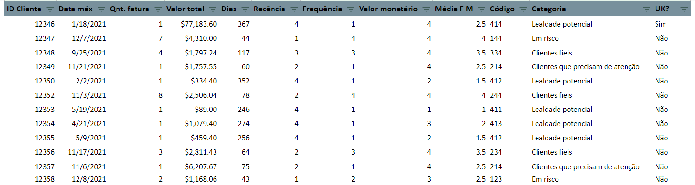

# Resultado final
- [Dashboard no Looker](https://lookerstudio.google.com/reporting/b2dd0a27-9550-40ea-aaca-8b90ffdeeb77/page/KG3tC?s=n5NXtjrVdio)
- [Tratamento no Google Sheets](https://docs.google.com/spreadsheets/d/1y0wnCgVJHK9eFSSqLrYQS9inzlI1--9fEsPQ3jJGNjw/edit?usp=sharing)

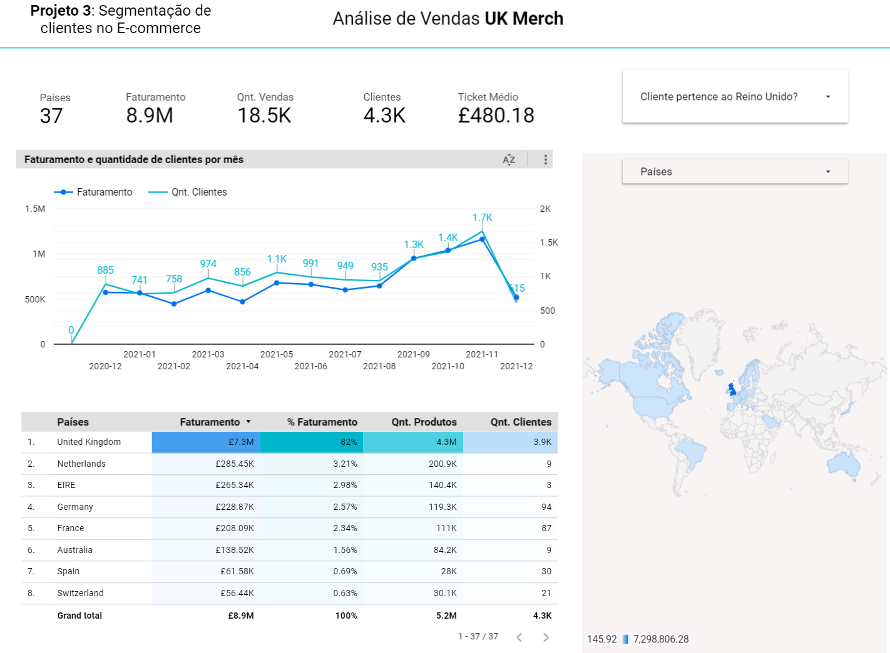

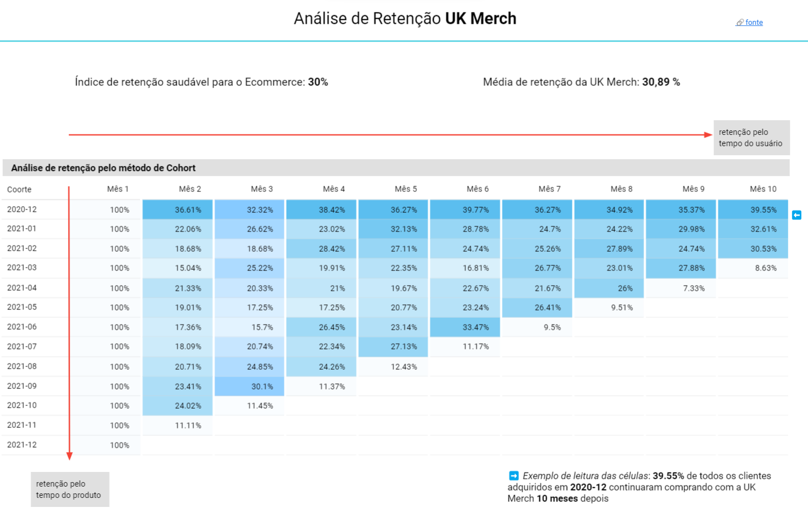

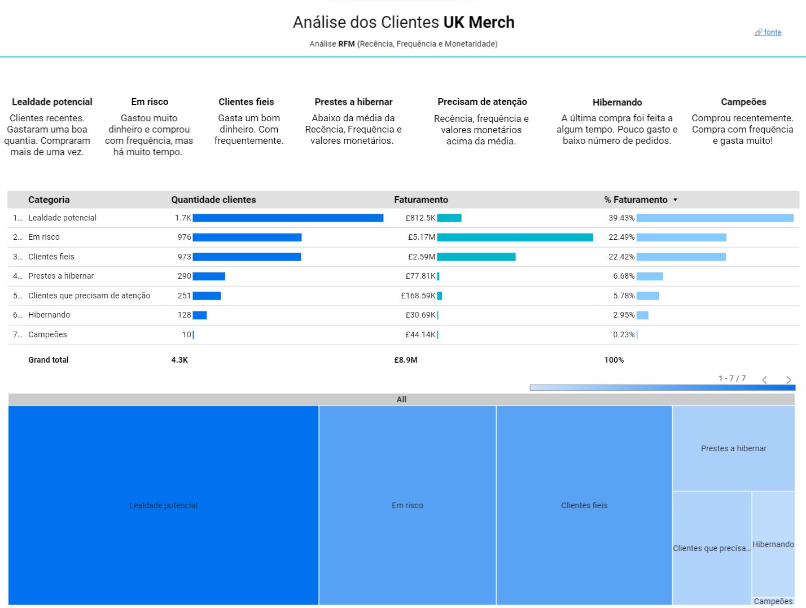

# Links
- [Instruções](https://www.kaggle.com/datasets/datacertlaboratoria/projeto-3-segmentao-de-clientes-no-ecommerce)
- [Guia passo a passo](https://www.kaggle.com/code/datacertlaboratoria/guia-de-resolu-o-projeto-3)
