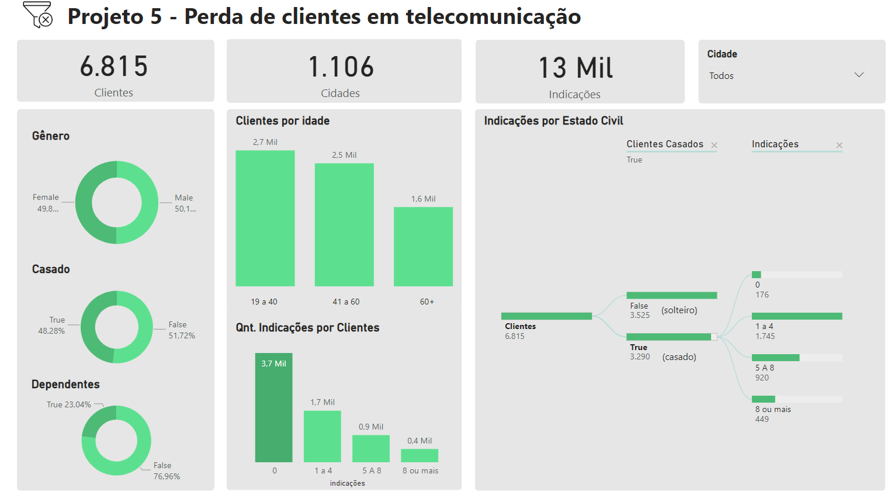
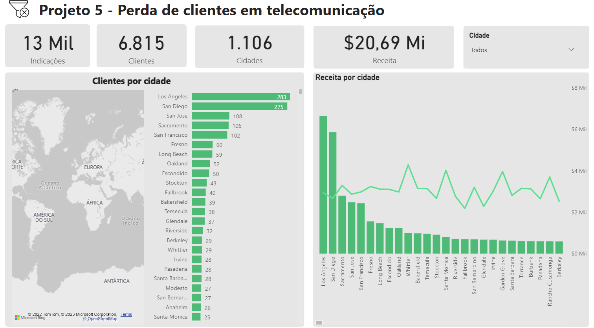
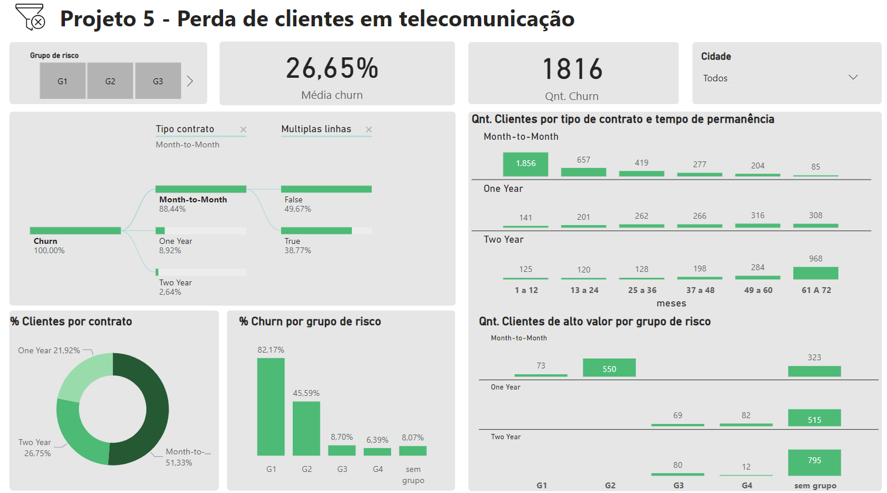

# Perda de clientes em telecomunicações
# Introdução
Esse foi o quinto projeto da Certificação de Análise de Dados da IBM/Laboratoria.

- Google Sheets, PowerBI, Google Big Query.

## Briefing
>Neste projeto você irá realizar uma análise de perdas para um negócio de telecomunicações. Para o desenvolvimento deste projeto, você colocará em prática o que aprendeu até agora e continuará aprofundando o uso de duas ferramentas importantes para todos os analistas de dados: BigQuery, um motor de base de dados criado pelo Google, que permite manipular dados de forma eficiente através da linguagem SQL; e PowerBI, uma ferramenta de visualização de dados criada pela Microsoft.

**Entregável:**
- Um vídeo de no máximo 5 minutos simulando uma prévia que você envia ao CEO, onde explica suas conclusões e recomendações. Para isso você pode contar com seu painel PowerBI ou montar uma apresentação no Google Slides. Para gravar a si mesmo recomendamos a plataforma Loom.
- Um painel no Power BI que tem todas as visualizações que você usou para argumentar suas conclusões do vídeo. 

## A situação
Os últimos meses foram bastante movimentados para sua carreira profissional. Para começar, no início deste ano você recebeu uma promoção muito merecida para “Analista de Dados”, removendo a palavra “Junior” do seu cargo. Este título parecia apropriado para você quando você estava começando no mundo dos dados, mas agora que você já tem alguns anos de experiência no mercado, com vários projetos em seu portfólio e que você sabe trabalhar com conjuntos de dados grandes em SQL, não há problema em deixar este título para trás. Além disso, a promoção deu a você um impulso motivador para continuar trabalhando em seu objetivo de longo prazo: tornar-se um Cientista de Dados.

Por este motivo, você aceitou a promoção com muito entusiasmo e vontade de conquistar esse novo desafio que seria apresentado a você alguns meses depois quando a empresa de telecomunicações onde você trabalha anunciou a aquisição da TELCO. TELCO é uma empresa jovem e com muito potencial, cujas filiais estão localizadas em 1.106 cidades do estado da Califórnia, Estados Unidos.

O mercado de ações catalogou esta aquisição como a mais importante da última década para o setor de telecomunicações. Para todos os efeitos práticos, a aquisição significa que sua empresa “comprou” a TELCO e os negócios se uniram. Todos os funcionários da TELCO se juntaram à sua empresa e uma dessas pessoas é Sebastián Ruiz Galindo, ex-diretor comercial da TELCO, que agora ocupa o cargo de Chief Growth Officer em sua empresa. Desde o momento em que você conheceu Sebastián, nos primeiros dias de sua posse, ele parecia um gerente competente. Ele era uma dessas pessoas com muitos anos de experiência, com capacidade de ver o quadro geral e chegar rapidamente a conclusões esclarecedoras. Sua experiência aguçou sua intuição. Talvez demais, porque muitas vezes ao invés de se comunicar através de dados, ele o fezia com anedotas e com base em sua experiência pessoal.

Essa qualidade de Sebastián só ficou evidente na reunião semanal do conselho em que você participou (agora que você não era mais “Junior” você foi convidado para essas reuniões). A reunião foi realizada para entender os desafios que a TELCO apresentou em termos de perda de clientes. Amalia, a CEO da sua empresa, queria entender como diminuir a perda de clientes na TELCO e, antes de assumir que os motivos eram os mesmos da sua empresa, decidiu que o melhor a fazer era realizar uma investigação profunda. Ao contrário de Sebastián, Amalia é uma pessoa que enfrenta novos desafios com uma mentalidade de descoberta. Ela está ciente do viés cognitivo (video: o que é viés cognitivo e 3 vieses) e dos problemas que surgem quando se supõe, ao invés de ir aos fatos. Um dos seus livros preferidos é:
“Rápido e devagar, duas formas de pensar” de Daniel Kahneman. Para Amalia, a simplificação excessiva é um mal que deve ser evitado. Portanto, ela gosta de entrar em detalhes e entender as nuances. Uma de suas frases favoritas, que você já ouviu várias vezes, é: "Quando você generaliza, está sempre errado". Seu escritório estava cheio de imagens hilárias como estas: Respostas simples mas erradas vs. respostas complexas mas corretas, O que não sabemos, não sabemos y O primeiro princípio é que você não deve se enganar e você é a pessoa mais fácil de enganar..

Sebastián estava fazendo uma apresentação cuja mensagem era, em suma, a seguinte:

A perda de clientes na TELCO se deve ao aumento da concorrência. Há cada vez mais concorrentes no mercado, principalmente na região de San Diego, o que nos faz perder mais clientes lá do que em outros lugares.
O problema são os contratos mensais. Se pudéssemos migrar todos os nossos clientes para contratos mais longos, todos os nossos problemas seriam resolvidos.
Quando Amalia perguntou sobre os dados, Sebastián respondeu: “Não tenho os dados em mãos, mas estou convencido de que estou certo. Isto é o que eu venho fazendo nos últimos 15 anos da minha carreira.”

Amalia fez Sebastián ver que suas conclusões eram generalizações e que havia mais detalhes para entender, mais nuances. “É claro para mim que os contratos mês a mês são mais propensos à perda do que os outros”, respondeu Amália, “mas como sabemos se esse efeito é o mesmo para todas as idades, ou se é o mesmo para os clientes com mais ou menos antiguidade? Da mesma forma, um cliente que indicou muitos outros clientes tem menos probabilidade de sair, mas como sabemos se o efeito mês a mês é mais ou menos importante do que o número de referências de um cliente? Não acho que seja tão simples quanto Sebastian sugere. Além disso, assumindo que a estratégia que você propõe acaba sendo a correta, ou seja, em geral buscamos movimentar os clientes para contratos mais longos, como priorizamos? Quem contatamos primeiro? Gostaria de fazer uma análise profunda da situação para entendê-la melhor. Como sempre, vamos abordar este problema com uma mentalidade de descoberta. Vamos ver qual história os dados nos contam e como eles se alinham ou se desviam de nossa visão preliminar.”

Como esperado, Amalia pediu que você liderasse esse esforço. Especificamente, eles concordaram que Sebastián lhe daria acesso aos dados (um conjunto de várias tabelas) para que você pudesse fazer um relatório com o seguinte:

Uma visão geral da população de clientes TELCO. Amalia quer entender as características dos clientes TELCO. Qual é a divisão por sexo? Eles têm dependentes? idades? cidades? etc.

Uma exploração de perdas para entender melhor as suposições de Sebastian sobre contratos mensais e a região de San Diego como a mais afetada. Algumas segmentações para entender a perda de clientes que saíram durante a reunião são:

- Grupo 1: Contrato mes-a-mes e idade > 64
- Grupo 2: Contrato mes-a-mes , idade < 64 e número de referências < 2
- Grupo 3: Contrato diferente de mes-a-mes, edad > 64 y número de referidos < 2
- Grupo 4: Contrato diferente a mes-a-mes e antiguidade em meses < 40
- Uma análise de clientes em “alto risco” de abandono priorizada de acordo com o valor monetário estimado que representam para a TELCO. Aqui a ideia é que após identificar os fatores que estão relacionados a perda de clientes (com base nos clientes que já saíram), você possa identificar quais clientes, da base de clientes que a TELCO ainda tem (ou seja, clientes que não saíram), se eles seriam mais propensos a deixar a empresa. E a partir dessa base, identifique aqueles clientes que possuem um alto valor monetário para a TELCO. Em outras palavras, você deseja priorizar aqueles clientes que são: i) propensos a sair (não saíram, mas estariam em risco de sair) e ii) de alto valor monetário. Amalia quer a lista desses clientes.

# Resolução
## 1. Importar os dados
Carregar o dataset no Google Big Query.

**Base de dados:**
- **Telco customer churn status** *(Telco_customer_churn_status.csv)*: Esta tabela contém informações sobre a perda de clientes da empresa para o próximo mês com base em vários fatores. A coluna "Churn Label" indica se o cliente saiu ou não no último mês. Outras colunas incluem o ID do cliente, o Índice de Satisfação, o motivo da perda de clientes, entre outros recursos.
- **Telco customer churn services** *(Telco_customer_churn_services.csv)*: Esta tabela mostra as características dos serviços contratados pelo cliente, entre as variáveis importantes está o pagamento mensal feito pelo cliente à empresa, receita total, encargos adicionais atribuídos ao cliente por exceder o download estabelecido ou dados limites de consumo, entre outros.
- **Telco customer churn location** *(Telco_customer_churn_location.csv)*: Esta tabela fornece informações de localização do cliente para o estado da Califórnia, tais como onde os serviços solicitados foram executados e inclui coordenadas exatas (latitude e longitude).
- **Telco customer churn population** *(Telco_customer_churn_population.csv)*: Esta tabela mostra a população total de cada cidade do estado da Califórnia onde o indicador de referência para cada cidade é a variável CEP.
- **Telco customer churn demographics** *(Telco_customer_churn_demographics.csv)*: Esta tabela mostra as características demográficas dos clientes que solicitaram os serviços da empresa TELCO, grande parte dessas variáveis ​​estão relacionadas às informações pessoais do cliente, como o número de dependentes que possui, se a pessoa é casada ou não, a idade, entre outros.

## 2. Criação de uma tabela
```sql
CREATE TABLE  `projeto5-355502.Dataset_telco.master_view` as (
SELECT l.* EXCEPT(Zip_Code),
        d.Gender,d.Age,d.Under_30,d.Senior_Citizen,
        d.Married,d.Dependents,d.Number_of_Dependents,
        s.Quarter,s.Referred_a_Friend,s.Number_of_Referrals,
        s.Tenure_in_Months,s.Offer,s.Phone_Service,
        s.Avg_Monthly_Long_Distance_Charges,s.Multiple_Lines,
        s.Internet_Service,s.Internet_Type,s.Avg_Monthly_GB_Download,
        s.Online_Security,s.Online_Backup,s.Device_Protection_Plan,
        s.Premium_Tech_Support,s.Streaming_TV,s.Streaming_Movies,
        s.Streaming_Music,s.Unlimited_Data,s.Contract,s.Paperless_Billing,
        s.Payment_Method,s.Monthly_Charge,s.Total_Charges,s.Total_Refunds,
        s.Total_Extra_Data_Charges,s.Total_Long_Distance_Charges,s.Total_Revenue,
        st.Customer_Status,st.Churn_Label,st.Churn_Value,
        st.Churn_Category,st.Churn_Reason 
FROM  `projeto5-355502.Dataset_telco.churn_location` as l
LEFT JOIN `projeto5-355502.Dataset_telco.churn_demographics` as d
ON l.Customer_ID = d.Customer_ID
LEFT JOIN `projeto5-355502.Dataset_telco.churn_services` as s
ON d.Customer_ID = s.Customer_ID
LEFT JOIN `projeto5-355502.Dataset_telco.churn_status` as st
ON s.Customer_ID = st.Customer_ID)
```
## Descrição das tabelas
- número total de registros que nosso quadro final possui (7043 registros)

```sql
SELECT COUNT(*) FROM `projeto5-355502.Dataset_telco.master_view`
```

- validar que todos os registros pertencem aos Estados Unidos

```sql
SELECT DISTINCT country FROM `projeto5-355502.Dataset_telco.master_view`
```

- validar que todos os registros pertencem ao estado da Califórnia

```sql
SELECT DISTINCT state FROM `projeto5-355502.Dataset_telco.master_view`
```

- o número de cidades que podem receber os serviços da empresa (1.1106 cidades)

```sql
SELECT DISTINCT COUNT(DISTINCT City) FROM `projeto5-355502.Dataset_telco.master_view`
```

- explorar distribuição das idades com MIN, MAX e AVG

```sql
AVG(Age) AS idade_media, #resultado: 47
MAX(Age) AS idade_maxima, #resultado: 119
MIN(Age) AS idade_minima #resultado: 19
FROM `projeto5-355502.Dataset_telco.master_view`
```

- pagamento mensal mínimo, máximo e médio da carteira de clientes da empresa TELCO


```sql
SELECT 
MAX(Monthly_Charge) AS pagamento_maximo, #resultado: 118.75
MIN(Monthly_Charge) AS pagamento_minimo, #resultado: -10
AVG(Monthly_Charge) AS pagamento_medio #resultado: 64.80
FROM `projeto5-355502.Dataset_telco.master_view`
```

- mesma consulta excluindo valores negativos

```sql
SELECT 
MAX(Monthly_Charge) AS pagamento_maximo, 
MIN(Monthly_Charge) AS pagamento_minimo,
AVG(Monthly_Charge) AS pagamento_medio 
FROM `projeto5-355502.Dataset_telco.master_view`
WHERE Monthly_Charge > 0
```

- número de clientes por gênero na carteira da empresa TELCO

```sql
SELECT 
DISTINCT Gender,
COUNT(Customer_ID) AS clientes_totais
FROM `projeto5-355502.Dataset_telco.master_view`
GROUP BY
1
```

- mostrar o número de clientes casados e solteiros

```sql
Married,
IF(married = true, COUNT(Married),COUNT(Married)) AS qnt_casamento
FROM `projeto5-355502.Dataset_telco.master_view`
GROUP BY
1
```

- 5 principais cidades com maior número de clientes na carteira da empresa TELCO

```sql
SELECT 
City,
COUNT(Customer_ID) AS clientes_totais
FROM `projeto5-355502.Dataset_telco.master_view`
GROUP BY
1
ORDER BY
2 DESC
LIMIT 5
```

## Limpeza da tabela
> Em relação à variável "Age", Sebástian havia nos dito anteriormente que a idade máxima admitida de acordo com o histórico de serviços é de 80 anos, e que as mensalidades não poderiam ser negativas ou nulas, pois as bases cadastravam os clientes que aceitavam os serviços prestados pela empresa TELCO. Perante todas estas anomalias ou erros nas bases de dados, é necessario realizar a limpeza da base, ou seja, precisamos realizar um filtro para evitar que sejam considerados os registos de clientes com idades superiores a 80 anos e não considerar registros negativos ou zeros na variável “Monthly Charge”.
> Além disso, precisamos padronizar as categorias da variável **Gender**, ou seja, converter a categoria “M” para Masculino e a categoria “F” para Feminino.

```sql
CREATE OR REPLACE TABLE `projeto5-355502.Dataset_telco.master_view` AS 
(
SELECT * EXCEPT (Gender),
CASE
WHEN Gender = 'F' THEN 'Female'
WHEN Gender = 'M' THEN  'Male'
ELSE gender END AS gender
FROM `projeto5-355502.Dataset_telco.master_view`
WHERE Age <= 80
AND
Monthly_Charge > 0
)
```

## Criação do dashboard
- segmentar as idades de acordo com a faixa etária que será de 19 a 40 anos, 41 a 60 e de 61 a mais

```sql
WITH
  tabela AS (
  SELECT
    *,
    CASE
	 WHEN Age < 41 THEN '19 a 40 anos'
    WHEN Age BETWEEN 41 AND 60 THEN '2. 41 a 60 anos' 
    ELSE 'Mais de 60 anos'
  END
    AS range_age
  FROM
    `projeto5-355502.Dataset_telco.master_view` )
SELECT
Customer_ID,
  City,
  Gender,
  Married,
  Dependents,
  range_age,
  COUNT(DISTINCT Customer_ID) AS total_clientes
FROM
  tabela
GROUP BY
  1,
  2,
  3,
  4,
  5,
	6
```

- pessoas casadas têm alguma relação com o número de referências, para isso será criada uma nova variável a partir dos seguintes intervalos:0 referências, 1 a 4 referências, 5 a 8 referências e mais de 8 referências

```sql
WITH
  tabela AS (
  SELECT
    *,
    CASE
      WHEN Number_of_Referrals = 0 THEN '0'
      WHEN Number_of_Referrals BETWEEN 1
    AND 4 THEN '1 a 4'
      WHEN Number_of_Referrals BETWEEN 5 AND 8 THEN '5 A 8'
    ELSE
    '8 ou mais'
  END
    AS reference_range
  FROM
    `projeto5-355502.Dataset_telco.master_view`)
SELECT
  City,
  Married,
  reference_range,
  COUNT(DISTINCT Customer_ID) AS total_clientes,
  SUM(Number_of_Referrals) reference_total
FROM
  tabela
GROUP BY
  1,
  2,
  3
```
- fazer segmentação range_tenure_months

```sql
WITH
  tabela AS (
  SELECT
    *,
    CASE
      WHEN Tenure_in_Months BETWEEN 1 AND 12 THEN '1 a 12'
      WHEN Tenure_in_Months BETWEEN 13
    AND 24 THEN '13 a 24'
      WHEN Tenure_in_Months BETWEEN 25 AND 36 THEN '25 a 36'
      WHEN Tenure_in_Months BETWEEN 37
    AND 48 THEN '37 a 48'
      WHEN Tenure_in_Months BETWEEN 49 AND 60 THEN '49 a 60'
      WHEN Tenure_in_Months BETWEEN 61
    AND 72 THEN '61 A 72'
  END
    AS range_tenure_months
  FROM
    `projeto5-355502.Dataset_telco.master_view` )
SELECT 
Customer_ID,
Contract, 
Multiple_Lines,
range_tenure_months,
COUNT(DISTINCT Customer_ID) AS total_clientes,
SUM(Tenure_in_Months) contrato_total
FROM tabela
GROUP BY 1,2,3,4
```

## Fazer churn por segmento
- segmentar de acordo com as hipóteses grupo de risco sebástian

```sql
WITH
  tabela AS (
  SELECT
    Customer_ID,
    Contract,
    Churn_Value,
    Total_Revenue,
    CASE
      WHEN Contract = 'Month-to-Month' AND Age > 64 THEN 'G1'
      WHEN Contract = 'Month-to-Month'
    AND Age < 64
    AND Number_of_Referrals <= 1 THEN 'G2'
      WHEN Contract != 'Month-to-Month' AND Age > 64 AND Number_of_Referrals <= 1 THEN 'G3'
      WHEN Contract != 'Month-to-Month'
    AND Tenure_in_Months < 40 THEN 'G4'
    ELSE
    'sem grupo'
  END
    AS risk_group
  FROM
    `projeto5-355502.Dataset_telco.master_view` )
SELECT
  risk_group,
  AVG(Churn_Value) AS ratio_churn
FROM
  tabela
GROUP BY
  1
```

- Para calcular o valor de um cliente, é necessário pensar a duração média por (considere a variável Tenure_in_Months como referência) que um cliente pode ter de acordo com o tipo de contrato.

```sql
SELECT
  Contract,
  AVG(Tenure_in_Months) AS media_antiguidade
FROM
  `projeto5-355502.Dataset_telco.master_view`
GROUP BY
  1
```

## Valor dos clientes

```sql
CREATE OR REPLACE TABLE
  `projeto5-355502.Dataset_telco.master_view`AS (
  WITH
    base_tenure_prom AS (
    SELECT
      Contract,
      AVG(Tenure_in_Months) AS media_tenure
    FROM
      `projeto5-355502.Dataset_telco.master_view`
    GROUP BY
      1 )
  SELECT
    a.*,
    b.media_tenure
  FROM
    `projeto5-355502.Dataset_telco.master_view` a
  LEFT JOIN
    base_tenure_prom b
  ON
    a.Contract = b.Contract )
```

- calculo do ingresso_estimado
```sql
CREATE OR REPLACE  TABLE `projeto5-355502.Dataset_telco.master_view` AS(
SELECT *,
    media_tenure*Total_Revenue/3 AS ingreso_estimado
FROM `projeto5-355502.Dataset_telco.master_view` a
)

#quartil estimado
CREATE OR REPLACE TABLE
  `projeto5-355502.Dataset_telco.master_view` AS (
  SELECT
    *,
    NTILE(4) OVER(PARTITION BY Contract ORDER BY ingreso_estimado ASC) AS quartil_estimado
  FROM
    `projeto5-355502.Dataset_telco.master_view`
  WHERE
    Churn_Value=0 )
```

- refiz a consulta para incluir a coluna risk_group

```sql
CREATE OR REPLACE TABLE
  `projeto5-355502.Dataset_telco.master_view` AS (
  SELECT
    *,
    CASE
      WHEN Contract = 'Month-to-Month' AND Age > 64 THEN 'G1'
      WHEN Contract = 'Month-to-Month'
    AND Age < 64
    AND Number_of_Referrals <= 1 THEN 'G2'
      WHEN Contract != 'Month-to-Month' AND Age > 64 AND Number_of_Referrals <= 1 THEN 'G3'
      WHEN Contract != 'Month-to-Month'
    AND Tenure_in_Months < 40 THEN 'G4'
    ELSE
    'sem grupo'
  END
    AS risk_group
  FROM
    `projeto5-355502.Dataset_telco.master_view` )
```

- consulta final
```sql
SELECT
  Contract,
  risk_group,
  COUNT(Customer_ID) AS total_clientes
FROM
  `projeto5-355502.Dataset_telco.master_view`
WHERE
  quartil_estimado IN (3,
    4)
GROUP BY
  1,
  2
ORDER BY
  1
```

# Resultado final
- [Dashboard no PowerBI](https://app.powerbi.com/view?r=eyJrIjoiOTcyODRiYjUtY2UwMS00MzIxLWIwNzItM2Y5ZDk2ZDAzZGQwIiwidCI6IjM2ZWEwNTgxLThmMTMtNGI3ZC1hZDFhLTZjZDUxYzY2NTIzNyJ9&pageName=ReportSection4963e6fc59ce0a008a8d)







# Objetivos da aprendizagem
- Importar dados de um arquivo em formato .csv
- Organizar e manipular dados utilizando SQL.
- Visualizar dados em uma ferramenta de Business Intelligence (BI).
- Entenda o fluxo e as etapas do processo de uma análise.
- Execute a limpeza de dados necessária.
- Preparar uma apresentação para as partes interessadas.
- Tomar decisões de negócios guiados por dados.

# Links
- [Instruções](https://www.kaggle.com/datasets/datacertlaboratoria/projeto-5)
- [Passo a passo](https://www.kaggle.com/code/datacertlaboratoria/guia-de-resolu-o-projeto-5)
