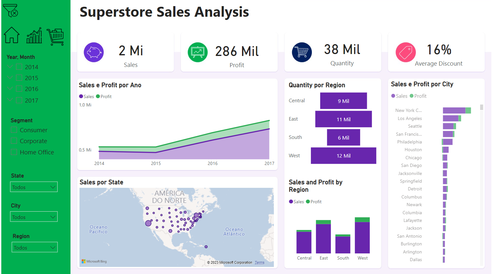
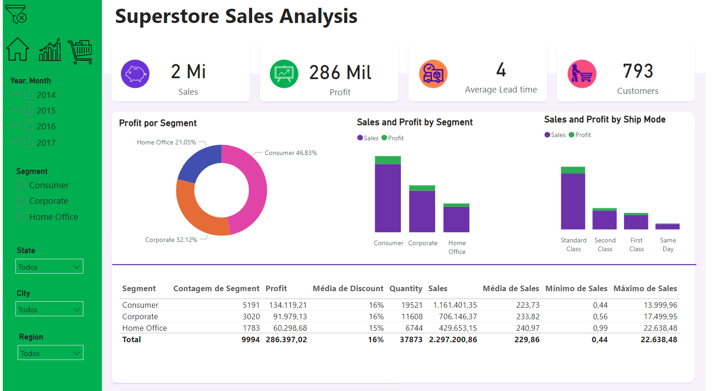
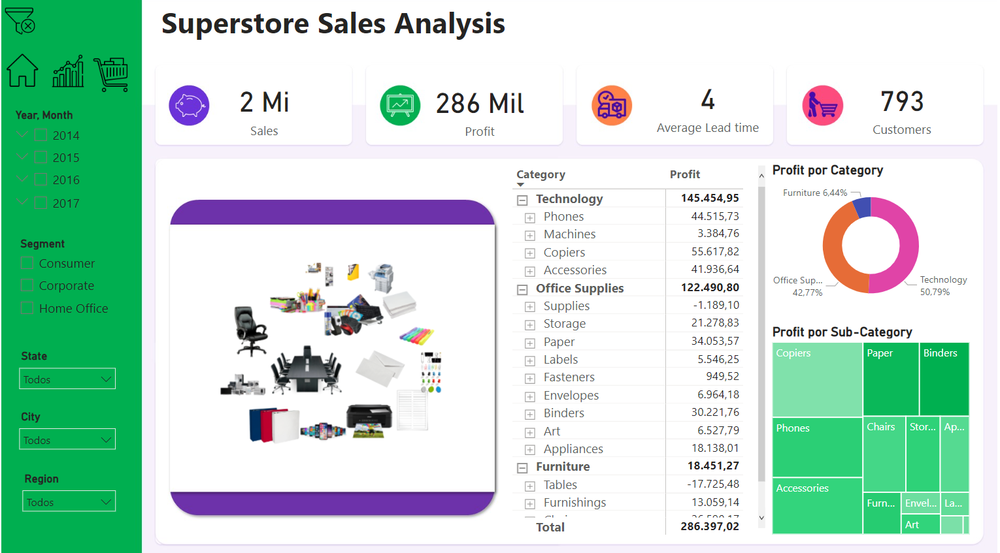

# Capstone 
# Introdução
Esse foi o sexto projeto da Certificação de Análise de Dados da IBM/Laboratoria. Por ser o último projeto do programa, o tema foi livre (sem guia de resolução).
- Google Sheets, PowerBI, Google Big Query.

# Base de dados
### Documentação
| Field name | Type | Description |  |
| --- | --- | --- | --- |
| Row_ID | INTEGER |  Unique ID for each row. | 9994 |
| Order_ID | STRING |  Unique Order ID for each Customer. | distintos 5009 |
| Order_Date | DATE |  Order Date of the product. | 2014-01-03 até 2017-12-30 |
| Ship_Date | DATE |  Shipping Date of the Product. | 2014-01-07 até 2018-01-05 |
| Ship_Mode | STRING |  Shipping Mode specified by the Customer. | Standard Class, Second Class, Same Day, First Class |
| Customer_ID | STRING |  Unique ID to identify each Customer. | 9994 |
| Customer_Name | STRING |  Name of the Customer. | distintos 50 |
| Segment | STRING |  The segment where the Customer belongs. | Consumer, Corporate, Home Office |
| Country | STRING |  Country of residence of the Customer. | United States |
| City | STRING |  City of residence of of the Customer. | 50 cidades |
| State | STRING |  State of residence of the Customer. | 49 estados |
| Postal_Code | INTEGER |  Postal Code of every Customer. | distintos 631 |
| Region | STRING |  Region where the Customer belong. | Central, East, West, South |
| Product_ID | STRING |  Unique ID of the Product. | distintos 1862 |
| Category | STRING |  Category of the product ordered. | Office, Supplies, Furniture, Technology |
| Sub_Category | STRING |  Sub-Category of the product ordered. | Art, Paper, Binders, Chairs, Phones, Storage, Furnishings, Envelopes, Tables, Fasteners, Machines, Accessories, Supplies, Labels, Bookcases, Appliances, Copiers |
| Product_Name | STRING |  Name of the Product | distintos 1850 (ps: tem produto com ID diferente, mas com nome igual) |
| Sales | FLOAT |  Sales of the Product. |  |
| Quantity | INTEGER |  Quantity of the Product. |  |
| Discount | FLOAT |  Discount provided. |  |
| Profit | FLOAT |  Profit/Loss incurred. |  |

# Resultado final
- [Dashboard no PowerBI](https://app.powerbi.com/view?r=eyJrIjoiOTEyYTMyMWMtMGNiNi00ZGVkLWJhNTEtMDM3ZWI0ZmFhNzA2IiwidCI6IjM2ZWEwNTgxLThmMTMtNGI3ZC1hZDFhLTZjZDUxYzY2NTIzNyJ9&pageName=ReportSection)

